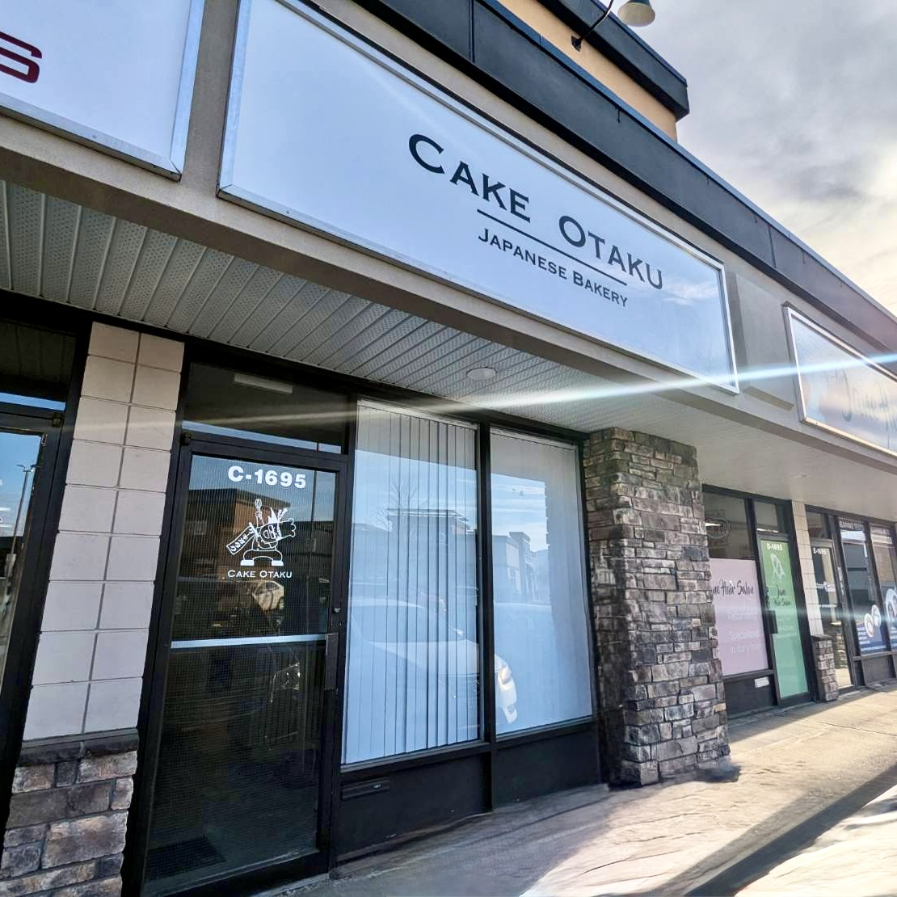

# Cake Otaku — Landing Page

A responsive, single-page landing site built for **Cake Otaku**, a Japanese-owned pastry shop in Kelowna, BC, Canada.

---

## Live Demo

<!-- Add live demo URL here -->

---

## Overview

A marketing website that presents the shop's menu, the pastry chef's biography, and contact details. The design follows a clean, minimal aesthetic that reflects the shop's brand identity.

**Sections:**
- **Home** — Logo, navigation, and Instagram link
- **Menu** — Photo gallery of cakes, tarts, and mochi
- **About** — Chef profile and career background
- **Contact** — Phone, email, and map location

---

## Tech Stack

| Tool | Role |
|------|------|
| HTML5 | Semantic, accessible markup |
| Tailwind CSS v4 | Utility-first responsive styling |
| Vite | Dev server and production build |
| Vanilla JS | Minimal scripting |

---

## Getting Started

```bash
npm install
npm run dev
```

Open [http://localhost:5173](http://localhost:5173) in your browser.

### Build for Production

```bash
npm run build
npm run preview
```

---

## Project Structure

```
Cake-Otaku/
├── index.html          # Single-page entry point
├── src/
│   ├── main.js         # JS entry
│   └── style.css       # Global styles + Tailwind imports
├── images/             # Product and profile photos
├── fonts/              # Custom typeface (Copperplate)
├── tailwind.config.js  # Tailwind configuration
└── package.json
```

---

## Screenshots



---

## Note

This is a client project built as a portfolio piece. All images and branding belong to Cake Otaku.

---
---

# Cake Otaku — ランディングページ

カナダ・ブリティッシュコロンビア州ケロウナにある日系パティスリー **Cake Otaku** のためにレスポンシブなランディングページを制作しました。

---

## 概要

ショップのメニュー、オーナーシェフの経歴、連絡先情報を掲載したマーケティングサイトです。ブランドイメージに合わせ、シンプルで洗練されたデザインを採用しています。

**セクション構成:**
- **Home** — ロゴ・ナビゲーション・Instagram リンク
- **Menu** — ケーキ・タルト・もちのフォトギャラリー
- **About** — シェフのプロフィールとキャリア紹介
- **Contact** — 電話・メール・地図リンク

---

## 使用技術

| ツール | 役割 |
|--------|------|
| HTML5 | セマンティックでアクセシブルなマークアップ |
| Tailwind CSS v4 | ユーティリティファーストのレスポンシブスタイリング |
| Vite | 開発サーバー・本番ビルド |
| Vanilla JS | 最小限のスクリプト |

---

## セットアップ

```bash
npm install
npm run dev
```

ブラウザで [http://localhost:5173](http://localhost:5173) を開きます。

### 本番ビルド

```bash
npm run build
npm run preview
```

---

## 備考

クライアント案件として制作したポートフォリオ作品です。画像・ブランド素材の著作権は Cake Otaku に帰属します。
